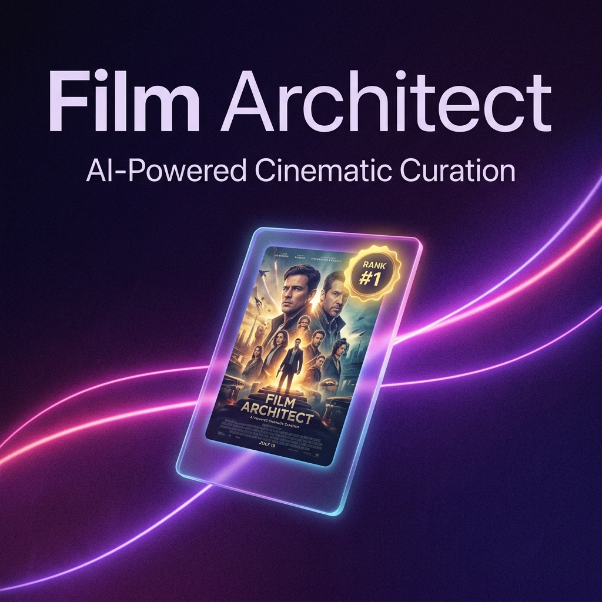

<div align="center">


# **Film Architect**

**AI-powered Tinder-style movie curation — swipe right on films you love, left on ones you don't.**

[](https://film-architect-curator.web.app)
[](https://github.com/traikdude/Film-Analysis-Architect/releases)
[](LICENSE)
[](#️-tech-stack)
[](https://github.com/traikdude/Film-Analysis-Architect/commits/main)

🌐 **[Live App → film-architect-curator.web.app](https://film-architect-curator.web.app)**

</div>

---

## **✨ Overview**

Film Architect is a personal web application that uses **Gemini AI** to curate and recommend films based on your chosen genres, eras, and themes. Each recommended film appears as a swipeable **holographic card** — swipe right to save it to your shelf, swipe left to skip it. Real movie poster images are fetched automatically from **TMDB** so every card looks like the real thing.

Built with a premium dark-mode UI, 3D holographic card effects, and five customizable color themes. Designed to make discovering films feel as intuitive as swiping through a social feed.

---

## **📑 Table of Contents**

* [Features](#-features)
* [Demo](#️-demo)
* [Quick Start](#-quick-start)
* [Installation](#-installation)
* [Configuration](#️-configuration)
* [Tech Stack](#️-tech-stack)
* [Roadmap](#️-roadmap)
* [License](#-license)

---

## **🔆 Features**

* **🤖 AI-Curated Recommendations** — Gemini 2.5 Flash generates 10 real film picks based on your selected genres, eras, and themes
* **🃏 Holographic Swipe Cards** — Tinder-style swipe deck with 3D tilt, glare, and rainbow holographic card effects
* **🖼️ Real Movie Posters** — Official poster images auto-fetched from The Movie Database (TMDB) API
* **❤️ Saved Shelf** — Every right-swipe is saved to your personal collection, browsable at any time
* **🎨 5 Color Themes** — Joyful, Oceanic, Forest, Film Noir, and Sunset palettes — live-switchable
* **📅 Era Filtering** — Set a from/to year range to discover films from any decade
* **🎭 Deep Genre Mix** — 40+ genre and sub-genre tags across Horror, Sci-Fi, Drama, Comedy, and more
* **🔑 Bring-Your-Own-Key** — Runs entirely in the browser using your own Gemini API key (no backend)
* **🌐 Firebase Hosted** — Deployed globally via Firebase Hosting for instant load times

---

## **🖼️ Demo**

<div align="center">

</div>

---

## **⚡ Quick Start**

Visit the live app — no installation required:

```
https://film-architect-curator.web.app
```

1. Click **⚙️** and enter your [Gemini API key](https://aistudio.google.com/app/apikey)
2. Select genres, set your era range
3. Hit **Generate Analysis**
4. Swipe right ❤️ to save, left ✗ to skip

---

## **📦 Installation**

**Prerequisites**

* Node.js ≥ 18
* A [Gemini API key](https://aistudio.google.com/app/apikey) (free tier works)
* *(Optional)* A [TMDB API key](https://www.themoviedb.org/settings/api) for real movie posters

**Setup**

```bash
git clone https://github.com/traikdude/Film-Analysis-Architect.git
cd Film-Analysis-Architect
npm install
```

Create a `.env.local` file:

```env
GEMINI_API_KEY=your_gemini_key_here
VITE_TMDB_API_KEY=your_tmdb_key_here   # optional but recommended
```

```bash
npm run dev        # Development server at localhost:3000
npm run build      # Production build → dist/
```

---

## **⚙️ Configuration**

| Option | Where | Description |
|--------|-------|-------------|
| `GEMINI_API_KEY` | `.env.local` | Gemini API key (baked at build time) |
| `VITE_TMDB_API_KEY` | `.env.local` | TMDB API key for poster images |
| Gemini Key | ⚙️ In-app Settings | Overrides build-time key, saved to `localStorage` |
| TMDB Key | ⚙️ In-app Settings | Overrides build-time key, saved to `localStorage` |

---

## **🏗️ Tech Stack**

| Layer | Technology |
|-------|-----------|
| Framework | React 18 + TypeScript |
| Build Tool | Vite 6 |
| Styling | Tailwind CSS (CDN) + custom CSS |
| AI | Google Gemini 2.5 Flash (`@google/genai`) |
| Movie Data | TMDB API v3 |
| Hosting | Firebase Hosting |
| Icons | Lucide React |

---

## **🗺️ Roadmap**

* [x] AI-curated movie recommendations via Gemini
* [x] Tinder-style swipe deck with holographic card effects
* [x] Real movie poster images via TMDB API
* [x] Saved Shelf for liked films
* [x] Firebase Hosting deployment
* [x] 5 color themes + era/genre filtering
* [ ] Share your saved shelf as a public list 🔜
* [ ] Trailer preview on card tap 🔜
* [ ] Import/export your movie list as JSON 🔜
* [ ] Mobile PWA support 🔜

---

## **🤝 Contributing**

This is a personal project, but suggestions and issues are welcome. Feel free to open an issue or fork the repo.

---

## **📄 License**

Released under the MIT License — see [LICENSE](LICENSE) for details.

---

## **🙏 Acknowledgements**

* [Google Gemini](https://deepmind.google/technologies/gemini/) — AI film curation engine
* [The Movie Database (TMDB)](https://www.themoviedb.org/) — Movie metadata and poster images
* [Lucide React](https://lucide.dev/) — Beautiful open-source icons
* [Firebase](https://firebase.google.com/) — Hosting infrastructure

---

<div align="center">

🏛️ *Part of the Brigade* · Built by **Erik** · <sub>Forged with care</sub>

</div>
